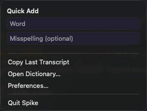

# Quick-add menu spike

Standalone AppKit status-item app for [ticket 33](../../docs/wayfinding/finishing-mini-whisper/tickets/33-quick-add-menu-spike.md). It imports no MiniWhisper code and does not ship.

The custom `NSMenuItem` hosts two plain `NSTextField`s. The other menu items are deliberately ordinary so keyboard navigation can be tested around the hosted view.

## Build and run

```sh
swiftc -framework AppKit \
  spikes/quick-add-menu/QuickAddMenu.swift \
  -o /tmp/quick-add-menu

/tmp/quick-add-menu                 # focus only after clicking a field
/tmp/quick-add-menu --focus-on-open # also tries to focus Word as the menu opens
```

Click the `QA` status item. Logs are printed to stdout. Return prints a line like this before closing the menu:

```text
[QuickAddMenu] COMMIT word="ghostty" misspelling="ghosty"
```

The focus-on-open mode logs each focus attempt and its resulting first responder. The 150 ms delayed attempt is intentional; the synchronous attempt demonstrates that the menu item does not have a window during `menuWillOpen`.

## Capture

```sh
./spikes/quick-add-menu/capture
./spikes/quick-add-menu/capture --focus-on-open /tmp/quick-add-menu.png
./spikes/quick-add-menu/capture --focus-on-click /tmp/quick-add-menu.png
```

The script builds and launches the spike, opens its menu through Accessibility, captures the menu bounds, and removes its temporary executable and log. Terminal/System Events may need Accessibility permission.



## VERDICT: viable with caveats

Tested on macOS 26.5.2 (25F84). The core interaction works with a view-based `NSMenuItem`: click, type in two fields, Return to commit and close. Plain `NSTextField` gives direct first-responder and command handling without another hosting layer. A separate `NSHostingView` probe with SwiftUI `TextField`s also accepted two-field typing, Tab, and Return once focused, so SwiftUI is not categorically blocked; the AppKit version is easier to reason about for this edge case.

### 1. Focus

Click focus is reliable and immediate. Clicking either field starts its field editor; clicking the custom item's otherwise empty background explicitly focuses Word.

Focus during `menuWillOpen` does not work synchronously: the hosted field has no window, `makeFirstResponder` returns `false`, and the responder remains `nil`. A main-queue attempt delayed by 150 ms does work after the menu window exists (`accepted=true`, responder=`word field editor`). The normal `menuDidOpen` callback did not provide a useful focus point while tracking in this test.

Production should prefer the deterministic click-to-focus interaction already required by the design. Auto-focus is possible, but it depends on delayed dispatch into the menu tracking loop and should not be the only path.

### 2. Typing and traversal

Typing remained reliable while `NSMenu` tracked. The test entered `Parakeet-TDT_v3 123` and `parakeet tdt version three`, including punctuation, spaces, and repeated transitions. No dropped keys or beeps were observed.

Tab moves Word → Misspelling and Shift-Tab moves Misspelling → Word. The AppKit implementation copies the active field editor's value back to its `NSTextField` before changing responders; without that explicit synchronization, responder transitions are easy to misread during testing. Tabbing back into a populated field selects its contents, which is standard text-field behavior.

Menu highlighting does take precedence for vertical arrows: pressing Down while a field is active immediately highlights the first ordinary sibling. A subsequent Return activates that sibling rather than committing the draft. This is coherent with menu keyboard navigation, but users should use Tab—not vertical arrows—to move between the two fields.

### 3. Return and Escape

Return reaches `NSTextFieldDelegate`, prints both captured values, calls `cancelTracking()`, and closes the menu. Values were preserved when committing from either field and after Tab/Shift-Tab traversal.

Escape is consumed by `NSMenu` tracking before the field delegate, SwiftUI `onExitCommand`, or an app-local key monitor can handle it. It immediately closes the entire menu. `menuDidClose` clears both fields, so the draft is aborted and never committed, but there is no interceptable “first Escape clears the fields while keeping the menu open” behavior in this implementation. A second Escape is not required because the first already dismissed the menu.

This is the main caveat. If “Escape aborts” allows the standard menu dismissal, the interaction is viable. If Escape must leave the surrounding menu open, use the decided Settings → Dictionary fallback rather than adding event-tap machinery.

### 4. Ordinary menu navigation

The hosted view does not degrade ordinary arrow navigation. From a newly opened, non-editing menu, consecutive Down presses highlighted `Copy Last Transcript`, `Open Dictionary…`, and `Preferences…`; Up returned to `Open Dictionary…`. The custom view and separators were skipped. Return activated the highlighted ordinary item normally.

Arrow navigation also remains available after field focus, as described above. It is arguably too available rather than degraded: Down leaves text editing and enters the sibling menu items immediately.
